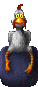

# "Catch the Chicken" - modification for Quake 2

## Game objective

 The object of 'Catch the Chicken' is to hold onto the chicken as long as you can without being fragged by your friends. You receive 1 point for every 10 seconds you hold onto the chicken(the time of course is variable). Players without the chicken can only hurt the chicken holder, not each other or themselves, so you can use big weapons as recklessly as you like.

## Features

- Any Quake II map works.
- New models, graphics and sounds!
- Short movie intro!
- Visible weapons supported transparently.
- GibStats support.
- Observer and chase camera modes.
- A little bit more...

Gameplay options:

- Chicken holder can/cannot use health
- Chicken holder can/cannot use armor
- Chicken holder can/cannot use invulnerable
- Chicken holder can/cannot throw the chicken(after having it for x seconds)
- All options are set in an ini file, some accessible from an in-game popup menu.

## Credits

- Jason Zuell: Programming
- Simon Hulsinga: All graphical stuff
- Paul Hulsinga: Sound engineer

## Other

- Originally was hosted at [PlanetQuake](https://web.archive.org/web/20000817003915/http://www.planetquake.com/chicken/) but now available only [here](https://www.quakewiki.net/archives/chicken/) and [here](https://www.moddb.com/mods/catch-the-chicken/downloads/catch-the-chicken-v20)
- [Q3 Catch the Chicken](https://openarena.fandom.com/wiki/ModCompat/Q3_Catch_the_Chicken)
